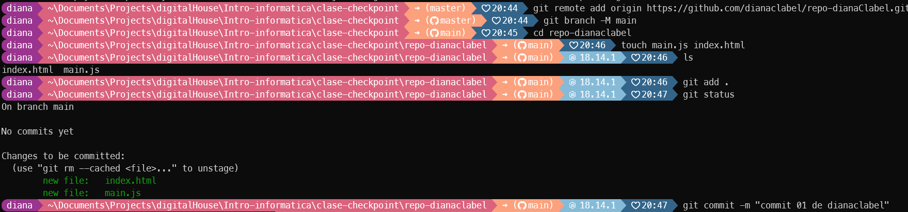

# Trebajando con Git y Github

## Descripción:

Se desarrollara un proyecto utilizando Git y GitHub
como sistema de control de versiones colaborativo. Podrás verificar tu
capacidad de cómo trabajar en un entorno distribuido, realizar cambios y crear
ramas utilizando las funcionalidades de Git y GitHub.

### Observaciones:

Todos los commits deberán tener el siguiente mensaje: _commit xx de NombreApellido_,
Reemplazando xx por el número de commit correspondiente y reemplazando la
palabra NombreApellido por el nombre de la persona que está haciendo el
commit.

**Ejemplo:** commit 01 de juanPerez
###Pasos a seguir:

1.  Creación de los repositorios:

    **a.** Crea un nuevo repositorio público vacío y asígnale un nombre que incluya la fecha actual, tu nombre y apellido. Por ejemplo,"Checkpoint-JuanPerez".

    **b.** Configuración del repositorio local: Debes crear un repositorio local con el mismo nombre del repositorio remoto y vincular el repositorio a tu máquina local utilizando el comando correspondiente.

2.  Desarrollo en la rama main:

    **a.** Crea los archivos: main.js e index.html, en la carpeta creada en el punto anterior.

    **b.** Una vez realizados los puntos anteriores debes hacer el primer commit. Recordar la sintaxis al realizar los commits.

    **c.** Luego de esto, realiza los pasos necesarios para subir estos primeros archivos al repositorio remoto en GitHub.

    

3.  Trabajo en ramas:

    **a.** Crea una rama denominada feature

    **b.** Posicionado dentro de la misma crea las siguientes carpetas:

        Hardware
        Software
        SeguridadInformatica.

    **c.** Dentro de cada carpeta crea un archivo llamado resumen.txt.

    **d.** Una vez realizada esta estructura de archivos y carpetas deberás
    realizar los pasos necesarios para hacer un push a la rama feature.

    

4.  Volviendo a main:

    **a.** Vuelve a posicionarte en la rama main.

    **b.** Renombra los archivos main.js por resumenHardware.txt e index.html por resumenSoftware.txt

    **c.** Dentro del archivo resumenSoftware.txt deberás:
    i. Listar 3 ejemplos de software.

    **d.** Dentro del archivo resumenHardware.txt deberás:

        Listar 3 memorias principales de la computadora.

    
    
    

5.  Listar los comandos:

    **a.** En la rama main, crea un archivo comandos.txt agregando los comandos que realizaste en este examen, haz el commit y sube los cambios al repositorio remoto, puedes utilizar el comando history para esto.
